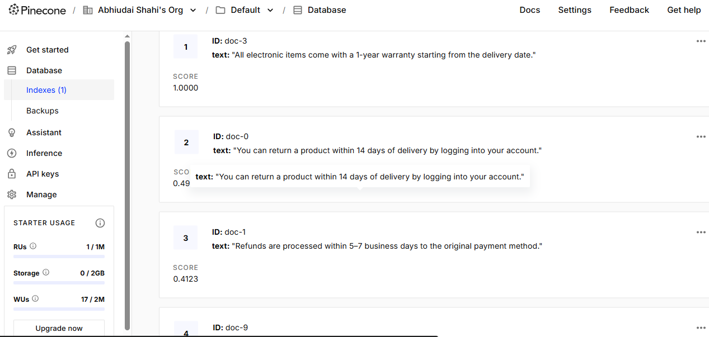

#  RAG-VectorDB: Retrieval-Augmented Generation with Pinecone

This project implements a **Retrieval-Augmented Generation (RAG)** pipeline using a **Vector Database (Pinecone)** to enhance question-answering systems by retrieving relevant context from custom documents.

---

##  What It Does

1. **Document Ingestion**: Loads and splits documents into chunks.
2. **Embedding**: Converts chunks into vector representations using an embedding model.
3. **Vector Storage**: Stores embeddings in **Pinecone** for fast similarity search.
4. **Query Handling**: Accepts a question, retrieves relevant document chunks via similarity search, and feeds them to a language model (like GPT) for final response generation.

---

##  Tech Stack

- 🧠 LLM: OpenAI / Cohere / HuggingFace (configurable)
- 📦 Vector DB: [Pinecone](https://www.pinecone.io/)
- 🔎 Embedding Model: Sentence Transformers / OpenAI Embeddings
- 🧾 LangChain or custom pipeline (modularized)

---

##  Pinecone Dashboard Preview

The following image shows how your vector data is successfully stored in Pinecone:

---

Configure API Keys
Edit the config.yaml file and include your:

OPENAI_API_KEY: "sk-..."
PINECONE_API_KEY: "your-pinecone-key"

---
##Notes
Uses cosine similarity or dot-product (depending on embedding model).

Supports metadata filtering and chunk size customization.

Can be easily extended to support Hybrid Search (BM25 + Vector) or Streaming Chat interfaces.
---
References
🔗 Pinecone Documentation

🔗 LangChain Documentation

🔗 OpenAI API Reference

🔗 Hugging Face Transformers

🔗 Sentence Transformers (SBERT)

🔗 Retrieval-Augmented Generation (RAG) Paper

🔗 Vector Similarity Search Explained

🔗 Hybrid Search Overview (BM25 + Vectors)
